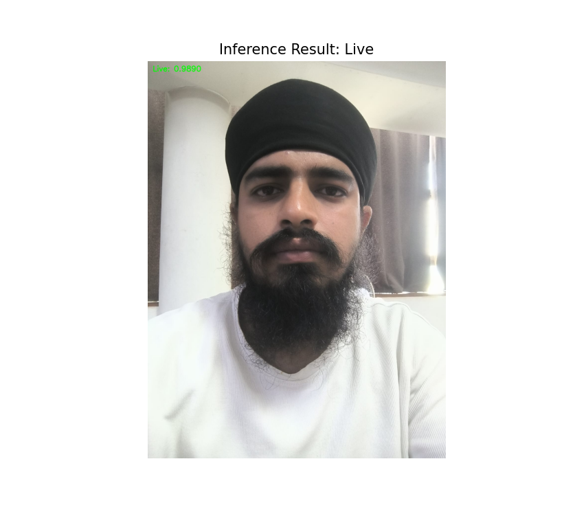
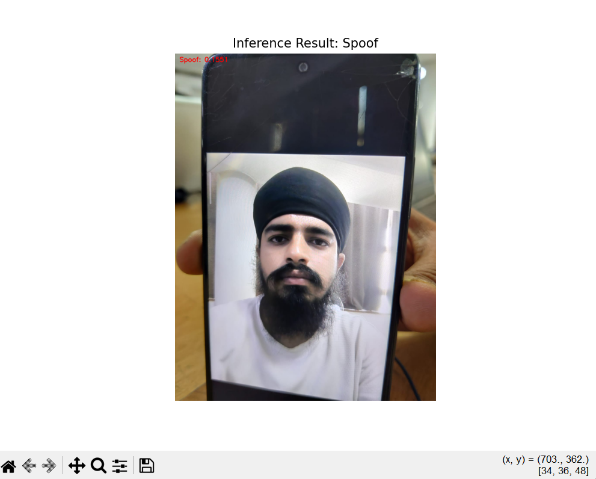
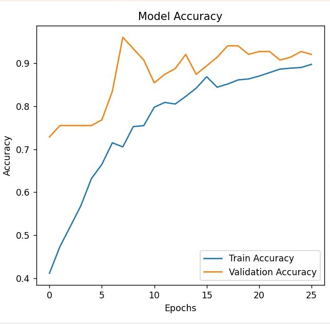
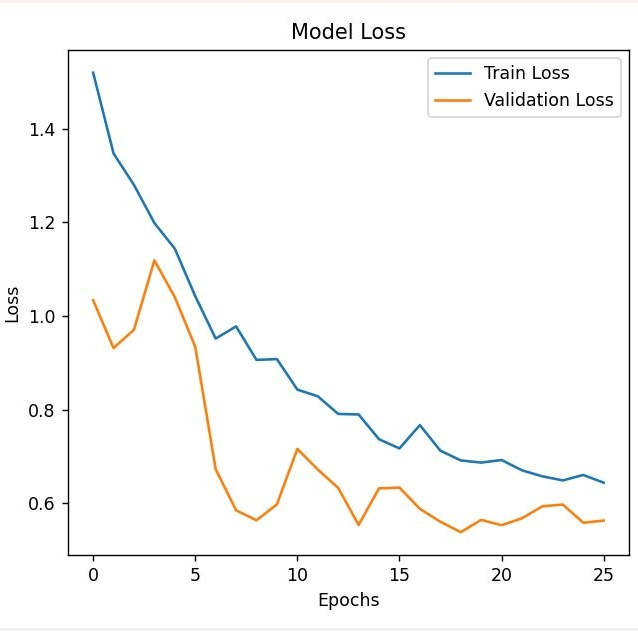
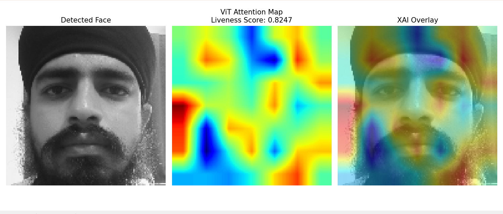

# Face Liveness Detection


This project provides a face liveness detection system using various models (CNN, Hybrid CNN-RNN, Vision Transformer, LBP+SVM). It's designed to classify face images as either "Live" or "Spoof" to prevent presentation attacks (e.g., holding up a photo to a camera).


## Features

- **Model Training:** Train different architectures using `main.py`.
- **Model Comparison:** Evaluate and compare metrics (Accuracy, FAR, FRR, HTER) using `compare_models.py`.
- **Inference:** Test single images via command-line using `inference.py`.
- **Live Webcam Testing:** Real-time liveness detection using your webcam with `webcam_liveness.py`.
- **Attention Visualization:** Visualize what the ViT model is looking at using `visualize_attention.py`.

## Results & Visualizations

### Inference Examples



### Model Performance
The models achieve robust performance distinguishing live subjects from spoof attempts. 




### ViT Attention Maps
The Vision Transformer model provides interpretability by showing where the model focuses its attention to determine liveness.


## Getting Started on a New Computer

Follow these instructions to deploy and run this project on another machine.

### Prerequisites

Ensure you have **Python 3.10+** installed on the target machine.

### 1. Clone or Copy the Repository

Transfer the entire project folder to your new computer.

### 2. Set Up a Virtual Environment (Recommended)

Navigate to the project directory and create a fresh virtual environment:

```bash
python -m venv .venv
```

Activate the virtual environment:

- **Windows:**
  ```bash
  .venv\Scripts\activate
  ```
- **macOS / Linux:**
  ```bash
  source .venv/bin/activate
  ```

### 3. Install Dependencies

A `requirements.txt` file is included with all necessary dependencies. Install them using pip:

```bash
pip install -r requirements.txt
```

_(Note: If you encounter issues with the full requirements list, the core libraries required are: `tensorflow`, `opencv-python`, `scikit-learn`, `numpy`, `matplotlib`, `joblib`, and `scikit-image`)_

### 4. Ensure Dataset/Models are Present

If you plan to retrain models, ensure the dataset is placed inside the `dataset/CASIA/` directory as structured in the code. If you only want to run inference, ensure the trained `.h5` or `.keras` models are in the `models/` or `liveness_model/` folders.

### 5. Running the Application

**Run Webcam Inference:**

```bash
python webcam_liveness.py
```

**Run Single Image Inference:**

```bash
python inference.py --image path/to/your/image.jpg
```

**Compare Models:**

```bash
python compare_models.py
```

**Train Models:**

```bash
python main.py
```

## Docker Deployment (Optional)

If you prefer using Docker to avoid environment issues, a `Dockerfile` is provided.

1. **Build the Docker Image:**
   ```bash
   docker build -t face-liveness .
   ```
2. **Run Inference in Docker:**
   ```bash
   docker run --rm -v ${PWD}:/app face-liveness python inference.py --image test_1.jpeg
   ```
   _(Note: Running the webcam script via Docker requires additional configuration to pass the webcam device to the container depending on your OS)._
